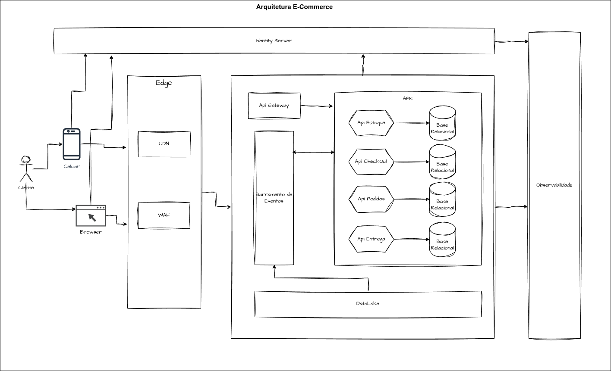
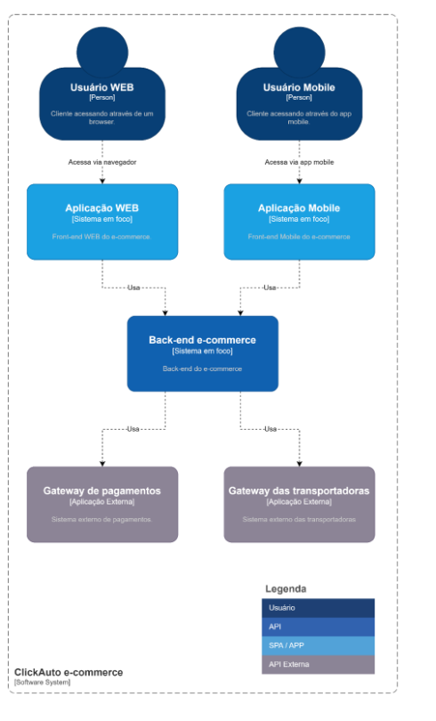
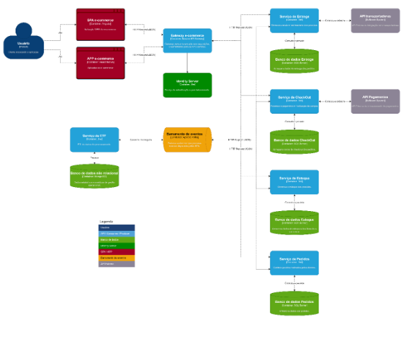
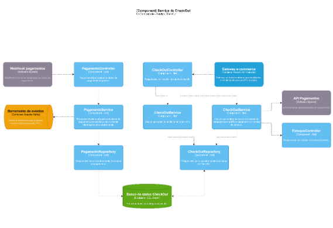
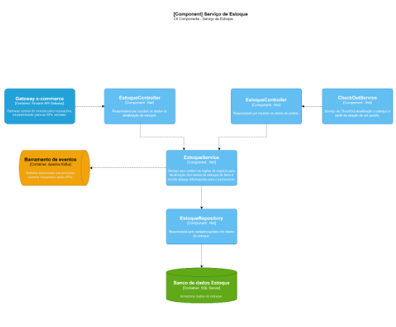
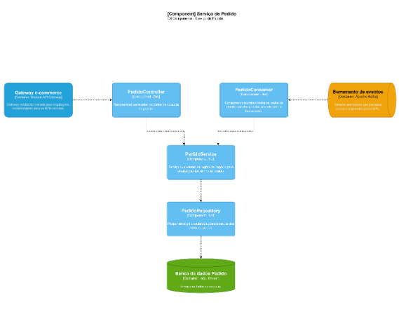

## 1. Montar um Story Telling sobre o problema que você resolve e definir o tema

## Story Telling: E-Commerce

### Problema
João sempre teve paixão por carros, mas toda vez que precisava comprar uma peça de reposição, era um pesadelo. As lojas físicas nem sempre tinham o que ele precisava, os preços variavam muito e os sites eram confusos e pouco confiáveis.

> "Se comprar uma peça errada, lá se vai dinheiro e tempo", pensava João.

Foi então que ele percebeu: por que não criar um e-commerce especializado em autopeças confiáveis, com entrega rápida e suporte personalizado?

### Desafio
Montar um e-commerce do zero não era fácil. João não sabia programar, não tinha experiência com logística e não sabia como atrair clientes. Mas ele tinha uma coisa: a vontade de resolver um problema real para milhares de motoristas.

Ele começou pequeno, vendendo peças no Instagram e atendendo os clientes pelo WhatsApp. Cada venda era comemorada, cada feedback ajudava a melhorar. Mas para escalar, era preciso mais.

Foi aí que ele tomou a decisão: investir em um site profissional, integrar meios de pagamento seguros e criar uma experiência de compra rápida e confiável.

### Crescimento
Com muito esforço, João lançou a **ClickAuto**, um e-commerce especializado em autopeças com catálogo intuitivo, entrega expressa e um chatbot que ajudava os clientes a escolherem a peça certa.

A estratégia funcionou! Clientes que antes tinham medo de comprar online passaram a confiar na ClickAuto. O boca a boca fez a marca crescer e, em menos de um ano, o site já vendia para todo o Brasil.

### Impacto
Hoje, João olha para trás e vê que o problema que ele enfrentava não era só dele, mas de muitos. A ClickAuto não só vende peças, mas oferece segurança e comodidade para motoristas e mecânicos.

### Resumo
Transformamos um problema em uma oportunidade, e uma ideia em um negócio de sucesso.

---

## 2. O que esperamos aprender com esse projeto?
- Como validar uma ideia de negócio antes de investir grandes recursos.
- Estratégias para estruturar e escalar um e-commerce.
- A importância da experiência do cliente para fidelização.
- Desafios e soluções na logística de autopeças.
- Como utilizar tecnologia para otimizar processos e melhorar a experiência do usuário.

---

## 3. Que perguntas precisamos que sejam respondidas?
- Qual é o perfil do nosso cliente ideal?
- Como garantir que os clientes encontrem exatamente as peças que precisam?
- Quais os melhores canais de marketing para atrair clientes?
- Como estruturar a logística para garantir entregas rápidas e eficientes?
- Quais tecnologias podem ser implementadas para melhorar a experiência do usuário?
- Como podemos diferenciar a ClickAuto da concorrência?

---

## 4. Quais são os nossos principais riscos?
- Dificuldade em encontrar fornecedores confiáveis com preços competitivos.
- Problemas logísticos que possam impactar a entrega e a satisfação do cliente.
- Concorrência acirrada no setor de e-commerce de autopeças.
- Fraudes em pagamentos e riscos financeiros relacionados a chargebacks.
- Falhas na experiência do usuário que possam afetar a conversão de vendas.
- Dependência excessiva de plataformas de terceiros para marketing e vendas.

---

## 5. Plano para aprender o que precisamos para responder às perguntas específicas
### Pesquisa de Mercado
- Realizar enquetes e entrevistas com clientes potenciais.
- Analisar concorrentes e suas estratégias de venda.
- Estudar relatórios de tendências do setor automotivo e e-commerce.

### Testes e Prototipagem
- Criar MVPs (Produto Mínimo Viável) e testar a aceitação do público.
- Implementar testes A/B para otimizar a experiência do usuário.
- Analisar métricas de conversão e comportamento dos usuários no site.

### Parcerias e Networking
- Estabelecer relações com fornecedores e entender suas políticas de preços e prazos.
- Buscar parcerias com influenciadores do setor automotivo para ampliar o alcance.
- Participar de eventos e feiras do setor para conhecer tendências e oportunidades.

### Investimento em Tecnologia e Marketing
- Implementar ferramentas de análise de dados para mapear preferências dos clientes.
- Utilizar SEO e campanhas pagas para atrair tráfego qualificado.
- Explorar estratégias de automação para atendimento ao cliente e personalização de ofertas.

### Monitoramento e Ajustes Contínuos
- Coletar feedback dos clientes e aplicar melhorias contínuas.
- Acompanhar indicadores de desempenho (KPIs) como taxa de conversão, retenção e satisfação do cliente.
- Ajustar estratégias de acordo com a resposta do mercado e novas tendências tecnológicas.

---

## 6. Plano para reduzir riscos
### Gestão de Fornecedores
- Criar contratos com fornecedores que garantam qualidade e prazos de entrega.
- Diversificar fornecedores para evitar dependência excessiva de um único parceiro.
- Implementar um sistema de avaliação contínua dos fornecedores.

### Otimização da Logística
- Trabalhar com múltiplas transportadoras para minimizar impactos de atrasos.
- Implementar rastreamento em tempo real para garantir transparência na entrega.
- Criar um centro de distribuição para otimizar a logística e reduzir prazos de entrega.

### Segurança em Pagamentos
- Utilizar gateways de pagamento seguros com ferramentas antifraude.
- Oferecer múltiplas opções de pagamento, incluindo boleto e PIX.
- Monitorar transações suspeitas e criar um sistema de alertas.

### Experiência do Usuário
- Realizar testes constantes para garantir um site rápido e intuitivo.
- Criar um processo de devolução simplificado e transparente.
- Implementar um chatbot para auxiliar clientes com dúvidas na escolha da peça certa.

### Estratégias Competitivas
- Criar programas de fidelidade para incentivar recompra.
- Investir em branding para construir uma identidade forte no mercado.
- Monitorar constantemente as estratégias da concorrência e adaptar-se rapidamente.

---

## 7. Quem são as partes interessadas?
- **Clientes:** Motoristas e mecânicos que precisam de peças de reposição com confiança e agilidade.
- **Fornecedores:** Empresas e distribuidores de autopeças que garantirão o estoque e a variedade de produtos.
- **Plataformas de Pagamento:** Empresas que processam os pagamentos e garantem transações seguras.
- **Operadores Logísticos:** Transportadoras e parceiros de entrega responsáveis pela distribuição eficiente dos produtos.
- **Equipe Interna:** Funcionários, desenvolvedores, equipe de atendimento e marketing que mantêm o e-commerce operando.
- **Investidores e Parceiros:** Possíveis interessados em financiar ou apoiar a expansão do negócio.
- **Órgãos Reguladores:** Instituições responsáveis por normas e tributações do setor automotivo e de comércio eletrônico.

---

## 8. O que eles esperam ganhar?
- **Clientes:** Facilidade na compra de autopeças, preços competitivos, segurança na transação e entrega rápida.
- **Fornecedores:** Um canal de vendas digital confiável para expandir seu alcance e aumentar as vendas.
- **Plataformas de Pagamento:** Volume crescente de transações e fortalecimento da reputação no setor automotivo.
- **Operadores Logísticos:** Um fluxo constante de entregas e novas oportunidades de negócios.
- **Equipe Interna:** Crescimento profissional e participação em um projeto inovador.
- **Investidores e Parceiros:** Retorno financeiro e crescimento sustentável.
- **Órgãos Reguladores:** Conformidade com normas e segurança para consumidores.

## 9. Quem são os usuários?

- **Motoristas individuais:** Proprietários de veículos que buscam peças de reposição para manutenção e reparo.
- **Mecânicos e oficinas:** Profissionais que necessitam de peças confiáveis para atender seus clientes com rapidez e eficiência.
- **Lojistas e revendedores:** Pequenos e médios negócios que compram autopeças para revenda.
- **Empresas de frotas:** Negócios que precisam manter veículos operacionais e reduzir custos de manutenção com peças confiáveis.
- **Entusiastas de carros:** Pessoas apaixonadas por automóveis que personalizam e melhoram seus veículos.

## 10. O que eles estão tentando realizar?

- **Motoristas individuais:** Encontrar e comprar peças corretas de forma rápida e segura, evitando gastos desnecessários e garantindo a manutenção do veículo.
- **Mecânicos e oficinas:** Adquirir peças confiáveis e com entrega ágil para atender clientes sem atrasos e manter a produtividade.
- **Lojistas e revendedores:** Ampliar seu portfólio de produtos sem necessidade de estoque próprio, garantindo acesso a peças de qualidade.
- **Empresas de frotas:** Reduzir custos operacionais e tempo de inatividade dos veículos com reposição eficiente de peças.
- **Entusiastas de carros:** Personalizar seus veículos com peças específicas, garantindo compatibilidade e desempenho desejado.

## 11. Qual o pior que pode acontecer?

- **Problemas financeiros:** Investir em um e-commerce exige recursos, e se ele não conseguir atrair clientes suficientes ou gerar lucro no início, isso pode levar a dificuldades financeiras, como endividamento ou até o fechamento do negócio.
- **Desconfiança dos consumidores:** Se o site não for bem projetado ou não oferecer uma experiência confiável, isso poderia afastar potenciais clientes, comprometendo a reputação da ClickAuto. O mercado de autopeças online é competitivo, e a confiança do cliente é essencial.
- **Dificuldades logísticas:** A logística de entrega de autopeças é um desafio, especialmente quando se trata de garantir que os produtos cheguem rapidamente e sem danos. Se João não conseguir implementar um sistema de distribuição eficiente, ele pode perder clientes para concorrentes.
- **Falta de expertise técnica:** Como João não tinha experiência em programação, criação de um site profissional ou marketing digital, ele poderia ter dificuldades em desenvolver um e-commerce de sucesso, levando a problemas com a integração de sistemas, processamento de pagamentos e atração de tráfego.
- **Concorrência feroz:** Se grandes players do mercado começarem a oferecer serviços similares ou melhores, João pode enfrentar dificuldades para se manter competitivo, especialmente em termos de preços, variedade e serviços.

## 12. Desenhe uma arquitetura (Modelo Freeform - Versão inicial); 

 
## 13. Descrição dos Componentes

### A. Cliente
- **Usuário final**: Representado por um ícone de uma pessoa que pode acessar o sistema via:
  - **Celular** (aplicativo móvel)
  - **Browser** (navegador web)

### B. Camada Edge
- **CDN (Content Delivery Network)**: Responsável por distribuir conteúdos estáticos para melhorar a performance e reduzir a latência.
- **WAF (Web Application Firewall)**: Protege contra ataques na camada de aplicação, como injeção de SQL e ataques DDoS.

### C. Identidade e Segurança
- **Identity Server**: Sistema de gerenciamento de identidade que autentica usuários e controla acessos.

### D. Gateway e Barramento de Eventos
- **API Gateway**: Ponto central de entrada para requisições, encaminhando para as APIs corretas.
- **Barramento de Eventos**: Sistema assíncrono que processa eventos disparados pelas APIs.

### E. Camada de APIs
- **API Estoque**: Gerencia o estoque dos produtos.
- **API CheckOut**: Processa o pagamento e finalização da compra.
- **API Pedidos**: Controla pedidos realizados pelos clientes.
- **API Entrega**: Gerencia o envio e rastreamento dos produtos.

### F. Bancos de Dados
- **Bases Relacionais**: Cada API tem sua própria base de dados relacional para armazenamento das informações.

### G. Data & Observabilidade
- **DataLake**: Armazena grandes volumes de dados estruturados e não estruturados.
- **Observabilidade**: Ferramenta para monitoramento e análise do sistema.

## 14. Requisitos Importantes

### A. Segurança e Autenticação Robustas
- **Por quê?** O e-commerce manipula dados sensíveis de clientes, incluindo informações pessoais e de pagamento.
  - A implementação de OAuth 2.0 / OpenID Connect no Identity Server garante autenticação segura.
  - WAF (Web Application Firewall) protege contra ataques como SQL Injection e Cross-Site Scripting (XSS).

### B. Escalabilidade e Alta Disponibilidade
- **Por quê?** Durante picos de tráfego (como Black Friday), o sistema precisa suportar um grande volume de acessos e transações sem falhas.
  - O uso de CDN ajuda a reduzir a carga nos servidores, distribuindo conteúdos estáticos.
  - Arquitetura baseada em APIs desacopladas e barramento de eventos permite escalar serviços separadamente.

### C. Monitoramento e Observabilidade
- O sistema de observabilidade deve coletar métricas em tempo real sobre latência, falhas e consumo de recursos. Logs centralizados e alertas automáticos ajudam a detectar anomalias antes que afetem os clientes.

### D. Integração com Múltiplos Meios de Pagamento
- Para oferecer uma experiência completa ao usuário, o checkout precisa suportar cartão de crédito, boleto, Pix e carteiras digitais (Apple Pay, Google Pay, PayPal).
  - APIs de pagamento devem ser seguras e estar em conformidade com PCI DSS (padrões de segurança para transações financeiras).

### E. Gerenciamento de Estoque em Tempo Real
- Para evitar overselling (vendas de produtos que não estão disponíveis), a API de Estoque deve ser capaz de processar eventos em tempo real via barramento de eventos, garantindo sincronização com pedidos e entregas.

## 15. Sobre o que o diagrama ajuda você a raciocinar/pensar?

Um diagrama ajuda a pensar por que transforma conceitos abstratos em algo visual e concreto, permitindo que você veja padrões, conexões e problemas que não seriam tão óbvios. Algumas razões para utilizá-lo:
- Definir o objetivo principal do sistema ou módulo que está modelando.
- Identificar os componentes-chave.
- Identificar e mapear as integrações.
- Destacar fluxos principais.
- Identificar gargalos, dependências, complexidade desnecessária ou áreas que precisam de mais detalhes.
- Experimentar diferentes soluções, como dividir um serviço monolítico em microsserviços ou testar novas estratégias de cache.

Para concluir, não é apenas uma forma de documentar, é uma ferramenta de raciocínio. Ele transforma um quebra-cabeça mental em algo visual, facilitando a análise, a inovação e a validação da solução.

## 16. Quais são os padrões essenciais no diagrama?

- **Atores (ou Entidades Externas)**: Representa as entidades externas que interagem com o sistema (usuários, sistemas externos etc.).
- **Componente (ou Bloco)**: Parte do sistema, como um serviço, módulo ou aplicação.
- **Conexões (ou Linhas de Interação)**: Indica a comunicação entre os componentes.
- **Setas de Fluxo de Dados**: Mostra como os dados fluem pelo sistema, revelando os processos ou passos específicos.
- **Notações de Comunicação (Protocolos/Conexões)**: Indica como os componentes se comunicam (ex: HTTP, WebSocket, gRPC).
- **Contêineres (para Microsserviços)**: Representa a estrutura do sistema, mostrando como diferentes serviços ou microsserviços estão agrupados.
- **Camadas (para Arquiteturas em Camadas)**: Representa a divisão de responsabilidades no sistema (ex: Camada de Apresentação, Camada de Lógica de Negócio, Camada de Dados).
- **Anotações e Legendas**: Serve para explicar partes do diagrama que não são imediatamente claras ou para detalhar aspectos técnicos como protocolos ou fluxos específicos.
- **Subdivisões (ou Pacotes)**: Agrupa componentes relacionados dentro de uma área, como uma "subarquitetura".

## 17. Existem padrões ocultos?

- **Arquitetura em Camadas**: Mesmo sem utilizar diagramas de camadas formais, você pode acabar representando a arquitetura em camadas de maneira implícita.
- **Dependências e Comunicação Direta**: À medida que você conecta componentes entre si, as dependências entre eles se tornam evidentes, o que pode indicar pontos críticos ou áreas de risco no sistema.
- **Modularização e Serviços Independentes**: Mesmo sem definir explicitamente microsserviços ou módulos, você pode acabar representando a modularização do sistema, onde diferentes áreas do sistema funcionam de forma independente, mas se comunicam entre si.
- **Padrão de Escalabilidade**: À medida que você desenha as interações, padrões relacionados à escalabilidade ou desempenho podem surgir, como a necessidade de balanceamento de carga ou caching.
- **Padrão de Tolerância a Falhas**: Muitas vezes, ao desenhar interações e fluxos de dados, você acaba representando, mesmo que implicitamente, estratégias de tolerância a falhas ou resiliência.
- **Segurança e Isolamento**: A segurança muitas vezes surge como um padrão implícito em um diagrama, mesmo sem ser destacado, especialmente no que diz respeito ao isolamento e controle de acesso entre componentes sensíveis.
- **Descentralização e Comunicação Assíncrona**: Em sistemas distribuídos, pode emergir o padrão de comunicação assíncrona e descentralização de forma natural, à medida que os componentes são conectados de maneiras que não requerem uma interação direta e síncrona.
- **Abstração e Interfaces**: Componentes que se comunicam através de interfaces bem definidas (APIs) podem surgir de forma implícita, com a arquitetura buscando abstrair implementações para permitir flexibilidade e escalabilidade.
- **Padrão de Cohesion e Coupling**: À medida que você organiza os componentes e suas interações, pode acabar refletindo um padrão de coesão (quanto os componentes dentro de um módulo estão relacionados entre si) e acoplamento (quanto os componentes dependem uns dos outros).

Podemos concluir que os padrões ocultos em diagramas de arquitetura aparecem conforme você organiza e conecta os componentes do sistema. Mesmo sem perceber, certas estruturas e boas práticas acabam surgindo naturalmente no design, ajudando a entender melhor como o sistema funciona, quais são suas dependências e o que ele realmente precisa.

## 18. Qual é o Metamodelo?

O metamodelo de um diagrama de arquitetura de sistemas define a base e os conceitos essenciais para sua criação. Ele funciona como um "modelo dos modelos", determinando quais elementos podem existir, como se conectam e quais regras orientam a estrutura do sistema.

Um metamodelo normalmente inclui:

- **Elementos Básicos**
  - Componentes (ex: microsserviços, módulos, APIs, banco de dados)
  - Conectores (ex: comunicação entre componentes, fluxos de dados, dependências)
  - Interfaces (ex: APIs, gateways, protocolos de comunicação)

- **Relacionamentos**
  - Chamadas síncronas ou assíncronas (ex: REST, WebSockets, Mensageria)
  - Dependências diretas ou indiretas (ex: um serviço depende de outro para funcionar)
  - Hierarquia e camadas (ex: frontend → backend → banco de dados)

- **Regras e Restrições**
  - Quem pode se comunicar com quem?
  - Quais padrões de segurança precisam ser seguidos?
  - Como os dados fluem pelo sistema?

## 19. Pode ser discernido no diagrama único?

Sim, dá para perceber o metamodelo em um diagrama único, mas com algumas limitações. Se o modelo estiver bem organizado e seguir certos padrões, é possível identificar a estrutura por trás dele apenas observando como os elementos estão dispostos. Mas um único modelo mostra só um caso específico e pode não revelar todas as regras e variações que o megamodelo permite.

### Como identificar o metamodelo em um diagrama único?

- **Organização dos elementos**: Se os componentes estão separados em camadas (ex: frontend, backend e banco de dados), isso indica uma estrutura lógica por trás.
- **Relação entre os componentes**: As conexões entre os elementos mostram regras implícitas de comunicação e dependência.
- **Padrões repetidos**: Se sempre há APIs REST para comunicação ou um banco de dados separado do backend, isso sugere uma lógica definida pelo metamodelo.

Embora seja possível perceber o metamodelo em um diagrama único, ele fica ainda mais claro quando comparamos vários modelos dentro do mesmo contexto.

## 20. O diagrama está completo?

O diagrama apresenta uma estrutura bem definida, cobrindo vários aspectos essenciais de um sistema, como:

- **Interfaces do Cliente**: Celular e Browser
- **Autenticação e Segurança**: Identity Server, WAF (Web Application Firewall)
- **Infraestrutura e Distribuição**: Edge, CDN
- **Camada de API e Comunicação**: API Gateway, Barramento de Eventos
- **Serviços Principais**: APIs para Estoque, Checkout, Pedidos e Entrega
- **Armazenamento e Dados**: Bases relacionais e Data Lake
- **Monitoramento**: Observabilidade

### Alguns pontos que poderiam ser avaliados:

#### Fluxo de Dados e Interações

- O diagrama mostra como os componentes interagem?
- As setas ou conexões estão indicando fluxos claros de requisição e resposta?

#### Faltam Componentes?

- Existe alguma lógica de cálculo de preços, antifraude ou comunicação com terceiros que deveria estar representada?
- Há necessidade de representar fila de processamento assíncrono para APIs críticas?

#### Escalabilidade e Resiliência

- O diagrama inclui estratégias como cache, replicação ou balanceamento de carga?

## 21. Poderia ser simplificado e ainda assim ser eficaz?  

Sim, o diagrama pode ser simplificado sem perder eficácia, dependendo do objetivo. Aqui estão algumas maneiras de torná-lo mais direto, mantendo as informações essenciais: 

### 1. Agrupamento de Componentes 
- Em vez de mostrar cada API separadamente, pode-se representar um bloco único de "Serviços de Negócio" ou "APIs Principais", reduzindo a complexidade visual.
- As bases de dados podem ser agrupadas como um único "Banco de Dados Relacional", a menos que seja crucial diferenciá-las. 

### 2. Redução de Elementos Secundários 
- O Edge, CDN e WAF podem ser representados como um único bloco de "Camada de Segurança e Distribuição", caso o foco do diagrama não seja segurança.
- Barramento de Eventos pode ser simplificado como "Mensageria/Eventos", se o nome técnico não for essencial. 

### 3. Melhor Representação de Fluxo 
- Setas e conexões podem ser organizadas para evitar cruzamentos excessivos e tornar o fluxo mais intuitivo.
- Dependendo do público-alvo, um diagrama em camadas (Cliente → Segurança → API → Dados) pode ser mais fácil de entender. 

### 4. Adaptação ao Contexto 
- Se o diagrama for para um time técnico, manter detalhes como APIs separadas faz sentido.
- Se for para um público não técnico ou executivo, pode ser mais eficaz representar apenas os blocos principais e suas interações. 

## 22. Houve alguma discussão importante que vocês tiveram como equipe?  

**Estratégia de Aquisição de Clientes**: Houve discussões sobre os melhores canais de marketing: Google Ads, redes sociais, SEO e parcerias com oficinas mecânicas. A equipe optou por um mix estratégico para testar diferentes abordagens. 

## 23. Que decisões sua equipe teve dificuldade para tomar?  

Com orçamento limitado, a equipe teve dificuldade em decidir entre anúncios pagos (Google/Facebook Ads) ou uma estratégia de crescimento orgânico (SEO, redes sociais). Optou-se por uma combinação inicial de ambas. 

## 24. Que decisões foram tomadas sob incerteza?  

A equipe ficou incerta sobre gastar dinheiro com anúncios no Google e redes sociais sem garantia de retorno. Optaram por começar com um orçamento pequeno e aumentar conforme os resultados.

## 25. Houve algum ponto de decisão sem retorno que o forçou a desistir de uma determinada escolha?  

No início, João considerou contratar uma equipe para desenvolver uma plataforma de e-commerce totalmente personalizada. No entanto, os altos custos e o longo tempo de desenvolvimento tornaram essa abordagem inviável para um negócio que precisava crescer rapidamente. Após avaliar alternativas, ele decidiu utilizar uma plataforma SaaS já existente, garantindo agilidade no lançamento da ClickAuto. Essa decisão, embora limitasse a personalização inicial, permitiu que o e-commerce fosse ao ar em poucos meses e começasse a gerar receita imediatamente.  

 

## 26. Desenhe 3 Arquiteturas com o projeto que você desenvolveu na aula em cada uma das camadas do C4; (Subir somente a Imagem jpg/jpeg) 

### Arquitetura de contexto

### Arquitetura de container

### Arquitetura de componentes

